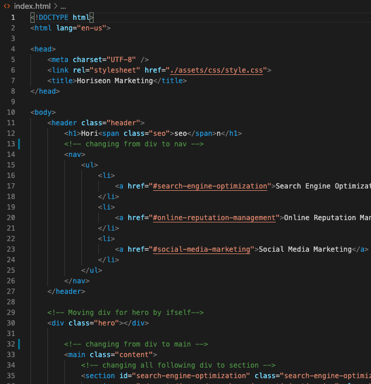
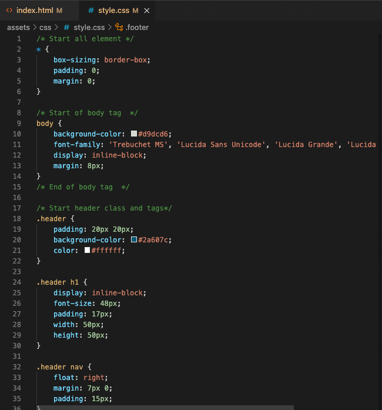

## Horiseon Marketing: Code Refactor

### Link of deployed application: 
https://kazichaska.github.io/horiseon/ 

### Description:
    One of the most common tasks for front-end and junior developers is to take existing code and refactor it to either meet a certain set of standards or implement a new technology. Web accessibility is an increasingly important consideration for businesses, ensuring that people with disabilities and/or socio-economic restrictions have access to their website. Accessible websites are better optimized for search engines, and help companies avoid litigation.

    To impress the imaginary client for this Challenge, you should go the extra mile and improve their codebase for long-term sustainability. Ensure that all links are functioning correctly and clean up the CSS to make it more efficient, such as by consolidating CSS selectors and properties, organizing them to follow the semantic structure of the HTML elements, and including comments before each element or section of the page.

### User Story

    ```
    AS A marketing agency
    I WANT a codebase that follows accessibility standards
    SO THAT our site is optimized for search engines
    ```

### Acceptance Criteria

    ```
    GIVEN a webpage that meets accessibility standards
    WHEN I view the source code
    THEN I find semantic HTML elements
    WHEN I view the structure of the HTML elements
    THEN I find that the elements follow a logical structure independent of styling and positioning
    WHEN I view the icon and image elements
    THEN I find accessible alt attributes
    WHEN I view the heading attributes
    THEN I find that they fall in sequential order
    WHEN I view the title element
    THEN I find a concise, descriptive title
    ```

### Screenshots of the code

